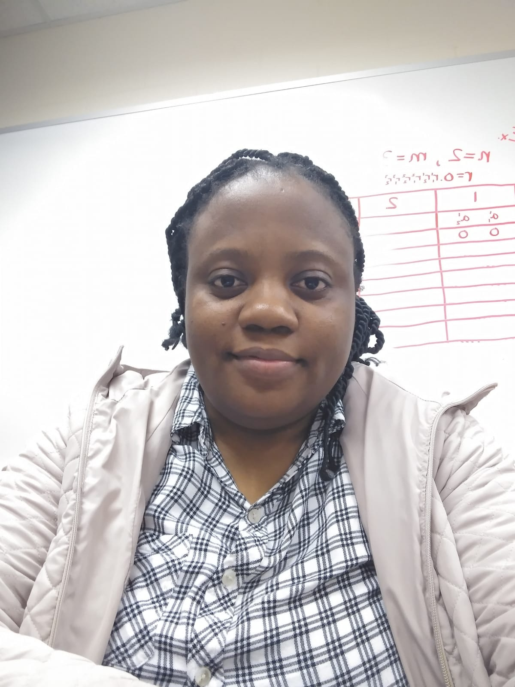

<h1 style = "text-align:center;color:#3090c7">Bukola Grace Omotoso</h1>

 &#9742; 615-720-4183   &nbsp;&nbsp;&nbsp;&nbsp;&nbsp;&nbsp; &#9993; gracomot@gmail.com

Software Development| Data Analysis| IT Audit & Information Security| Computer Vision

A Computer Scientist with bachelors and masters degree in Computer Science.  I have over 8 years of diverse practical IT professional experience that includes Software Development, IT Audit and Information Security, Data Analysis, and Computer Vision. See my <a href="https://www.linkedin.com/in/bukola-grace-omotoso-18003345/
 " target="_blank">linkedin profile</a> and <a href="Resume.pdf" target="_blank">Resume</a>  for more details. I have a good blend of technical and soft skills. I act professionally, communicate effectively and manage stakeholders' expectations well. My research interests are in the areas of High Perfomance Computing, Natural Language Processing Computer Vision and Deep Learning. 
I have done quite a bit of research in some of the listed areas and I am currently taking a <a href="https://www.coursera.org/specializations/deep-learning
" target="_blank">deep learning </a>course on coursera.
 

<h2>Education and Research</h2>
Going  through the <a href=" https://www.mtsu.edu/programs/computer-science-ms/index.php
 " target="_blank">Computer Science Masters program</a> at the Middle Tennessee State University brought a paradigm shift to my research interest and career. I took some classes in High Performance Computing (HPC), Artificial Intelligence and Natural Language Processing (NLP). See my  <a href="Transcript.pdf" target="_blank">Transcript</a> for more details. My HPC classes exposed me to some parallel processing techiques like the Partitioned Global Address Space (PGAS) model such as OpenSHMEM and one-sided. I also learnt how to distribute processes across a GPU such as CUDA. Taking those classes pushed me further to do my thesis in HPC. Check my <a href="https://scholar.google.com/citations?user=_IK4Zr0AAAAJ&hl=en#d=gs_md_cita-d&u=%2Fcitations%3Fview_op%3Dview_citation%26hl%3Den%26user%3D_IK4Zr0AAAAJ%26citation_for_view%3D_IK4Zr0AAAAJ%3Au5HHmVD_uO8C%26tzom%3D300" target="_blank">thesis publication</a> on Google Scholar for more details.

 <h2>Personal</h2>
 I have a friendly personality and great people skills. Here is a <a href="https://www.kudoboard.com/boards/TdmmrNvc?rid=33742eb0#view" target="_blank">Kudoboard</a> that shows what some of my former co-workers at HCA Healthcare said about me. I love <a href="family.html" target="_blank">family</a> times, cooking and reading to my 3yr old Daughter.
 

